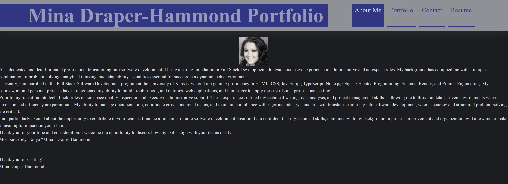

# React Portfolio

## Description

This is a personal portfolio built using React, designed to showcase projects, skills, and resume details. The application is built as a single-page application (SPA) with React Router for navigation. It includes a header, footer, and multiple sections to highlight the developer's work.

## Features

- **Single Page Application (SPA)** with React Router for seamless navigation
- **Header Component** displaying the developer's name and navigation links
- **Navigation Component** allowing smooth transitions between different sections
- **Portfolio Section** displaying six projects with links to GitHub repositories and live demos
- **About Me Section** containing a developer bio and a profile image
- **Contact Section** with a form for visitors to get in touch
- **Resume Section** providing a downloadable resume and a list of proficiencies
- **Footer Component** with links to GitHub, LinkedIn, and a third platform (e.g., Twitter or Stack Overflow)


## Deployment

This portfolio is deployed using Netlify. [react-portfolio-mina.netlify.app](https://react-portfolio-mina.netlify.app/)

## Installation and Usage

To set up and run the project locally:

1. Clone the repository:
   ```sh
   git clone <repository-url>
   ```
2. Navigate to the project directory:
   ```sh
   cd react-portfolio
   ```
3. Install dependencies:
   ```sh
   npm install
   ```
4. Start the development server:
   ```sh
   npm run dev
   ```
5. Open the browser and navigate to the provided local development URL.

## Technologies Used

- React
- React Router
- JavaScript (JSX)
- Vite
- Netlify (for deployment)

## Screenshots



## Resources
The University of Kansas

## Collaborations

It has been a pleasure to work on this project with my Teammates from The University of Kansas... Fisher Almanza, Danny Wortmann and Stephen Schier.


## Links / ## Contact


- **GitHub Repository**: [https://github.com/VampMina528/React-Portfolio-Mina](#https://github.com/VampMina528/React-Portfolio-Mina)
- **LinkedIn**: [www.linkedin.com/in/tanya-draper-hammond-398b2334](#www.linkedin.com/in/tanya-draper-hammond-398b2334)

---


